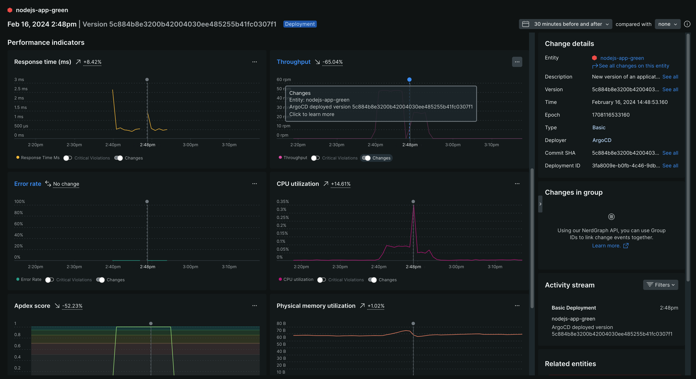

# New Relic ArgoCD Notification Example

This repo contains example YAML for enabling [ArgoCD Notifications](https://argocd-notifications.readthedocs.io/en/stable/) as [New Relic Change Tracking](https://docs.newrelic.com/docs/change-tracking/change-tracking-graphql/) events.

## Installing / Getting started

1. Define your New Relic User API Key in your `argocd-notifications-secret` Secret.  

An example can be found [here](./argocd-notifications-secret.yaml).

```yaml
...
stringData:
  newrelic-apiKey: NRAK-YOURAPIKEYGOESHERE
...
```

2. Add the New Relic `trigger`, `template`, and `service` to your `argocd-notifications-cm` ConfigMap.  

The default catalog can be found [here](https://raw.githubusercontent.com/argoproj/argo-cd/master/notifications_catalog/install.yaml).

```yaml
...
trigger.app-deployed: |
  - description: Application is synced and healthy. Triggered once per commit.
  oncePer: app.status.sync.revision
  send:
   - newrelic-app-deployed
  when: app.status.operationState.phase in ['Succeeded'] and app.status.health.status == 'Healthy'
template.newrelic-app-deployed: |
  webhook:
    newrelic:
      method: POST
      body: |
        mutation {
          changeTrackingCreateDeployment(
            deployment: { 
            version: "{{.app.status.sync.revision}}",
            entityGuid: "{{.app.metadata.annotations.entityguid}}",
            commit: "{{.app.status.sync.revision}}",
            user: "ArgoCD",
            deploymentType: BASIC,
            description: "New version of an application {{.app.metadata.name}} has been deployed."
            }
          ) {
            deploymentId
             entityGuid
          }
        }
service.webhook.newrelic: |
  url: https://api.newrelic.com/graphql
  headers:
  - name: Content-Type
    value: application/graphql
  - name: Api-Key
    value: $newrelic-apiKey
...
```

3. Apply the changes to your ArgoCD instance.

```yaml
kubectl apply -f argocd-notifications-secret.yaml -n argocd
kubectl apply -f argocd-notifications-cm.yaml -n argocd
```

## Configuring your ArgoCD Applications

An ArgoCD Application needs to "subscribe" to notifications so you'll need to add the following annotations to your application.

Check out the example application [here](./argocd-application/notification-demo.yaml).

```yaml
...
annotations:
  notifications.argoproj.io/subscribe.newrelic-app-deployed.newrelic: ""
  entityguid: "<NEW RELIC ENTITY GUID>"  
...
```

`entityguid` is the New Relic entity guid for the APM application.  You'll need to perform an initial deployment of your app in order to generate an entity guid in the New Relic platform.  Subsequent deployments can then be associated with this guid.


## New Relic Change Tracking

After the ArgoCD deployment process completes, you should see the change tracking event and the before and after state of the application in New Relic.

